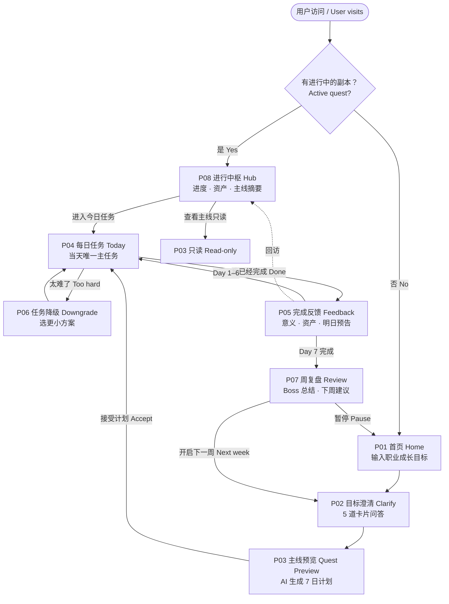
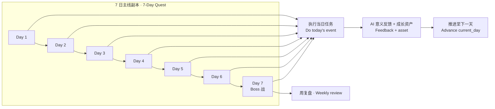
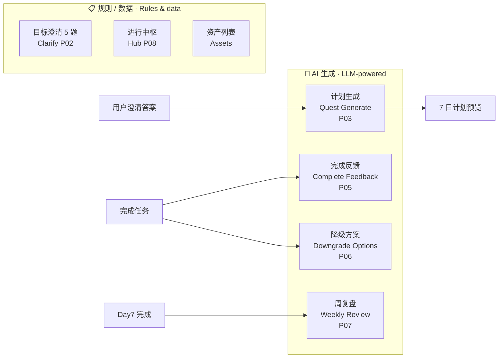

<div align="center">

# GoalSlice 就这

**把长期目标，变成这一周能完成的小事件。**

*Turn long-term career goals into small events you can finish this week.*

<br />

每天一件事 · 低压力推进 · AI 陪你走完 7 天小闭环

*One quest per day · Low pressure · AI-guided 7-day growth loop*

<br />

[快速开始](#快速开始--quick-start) ·
[业务全流程](#业务全流程--user-journey) ·
[启动文档](docs/startup.md) ·
[产品 PRD](docs/PRD.md) ·
[API 契约](docs/api-contracts.md)

</div>

---

## 目录 · Table of Contents

- [产品是什么](#产品是什么--what-is-goalslice)
- [核心价值](#核心价值--why-it-matters)
- [业务全流程](#业务全流程--user-journey)
- [AI 能力地图](#ai-能力地图--where-ai-helps)
- [页面一览](#页面一览--pages)
- [技术栈](#技术栈--tech-stack)
- [快速开始](#快速开始--quick-start)
- [项目结构](#项目结构--project-structure)
- [测试](#测试--testing)
- [文档](#文档--documentation)

---

## 产品是什么 · What is GoalSlice?

**GoalSlice 就这** 是一款 **AI 职业成长助手**。

你只需用一句话说出模糊的成长目标——比如「想提升会议总结能力」「准备转行」——产品会引导你澄清意图，生成一条 **7 日主线副本（Quest）**，然后每天推送 **一件足够小、做得完、做得有意义** 的任务。完成后，AI 告诉你「这一步为什么重要」，并发放可积累的成长资产；一周结束时，带你复盘并决定是否开启下一周。

> **GoalSlice** is an **AI career-growth companion**. Describe a fuzzy goal in plain language, clarify your intent through a short questionnaire, accept a **7-day quest line**, and complete **one small, meaningful task per day**—with AI feedback, collectible growth assets, and a weekly review to decide what comes next.

**MVP 聚焦** · *MVP scope*

| ✅ 做 | ❌ 暂不做 |
|------|----------|
| 职业成长 / 技能提升类目标 | 习惯、健康、情绪等非职业目标 |
| 单目标、单副本（7 天） | 多目标并行、社交、积分商城 |
| Guest 模式（`session_id`） | 用户登录与账号体系 |

**北极星** · *North star*: 用户是否完成一个 **7 天职业成长小闭环**，并愿意开启下一周。

---

## 核心价值 · Why it matters

| # | 中文 | English |
|---|------|---------|
| 1 | 把模糊目标具体化 | Turn vague ambitions into concrete weekly quests |
| 2 | 把长期目标拆成「今天这一件」 | Break the long arc into today's single action |
| 3 | 每天只推进一件事，降低放弃率 | One event per day—low enough to actually finish |
| 4 | 完成后解释「意义」，而不只是打勾 | Meaningful feedback, not empty checkmarks |
| 5 | 成长资产可视化，看见自己在变强 | Growth assets you can see accumulate |
| 6 | 周复盘 + 可选下一周，形成连续成长 | Weekly review and optional next-week loop |

---

## 业务全流程 · User Journey

下图是用户从「第一次来访」到「完成一周并开启下一周」的完整业务路径（对应产品页面 P01–P08）。

*The diagram below shows the end-to-end user journey from first visit through completing a week and optionally starting the next.*



### 7 日副本内循环 · Inside the 7-day quest



---

## AI 能力地图 · Where AI helps

四个环节调用大模型（硅基流动 · `Qwen/Qwen3.5-27B`）；澄清与中枢展示为规则 / 数据库驱动。

*Four steps invoke the LLM; clarification and hub views are rule- or database-driven.*



| 环节 | 页面 | API | LLM 不可用时的行为 |
|------|------|-----|-------------------|
| 计划生成 | P03 | `POST /quests/generate` | **503** + 友好提示 |
| 完成反馈 | P05 | `POST /events/{id}/complete` | 静态模板 fallback |
| 任务降级 | P06 | `POST /events/{id}/downgrade` | 静态方案 fallback |
| 周复盘 | P07 | `POST /quests/{id}/review` | 静态复盘 fallback |

---

## 页面一览 · Pages

| 页面 | 路由 | 一句话 | One-liner |
|------|------|--------|-----------|
| P01 首页 | `/` | 输入成长目标 | Enter your growth goal |
| P02 澄清 | `/clarify` | 5 题卡片流，收窄目标 | 5-card clarify flow |
| P03 主线预览 | `/quest/preview` | AI 7 日计划，确认后开始 | AI 7-day plan preview |
| P04 每日任务 | `/quest/today` | 今天唯一要做的事 | Today's single quest |
| P05 完成反馈 | `/quest/feedback` | 意义解释 + 成长资产 | Meaning + growth asset |
| P06 降级 | Modal on P04 | 太难时选更小任务 | Easier task alternatives |
| P07 周复盘 | `/quest/review` | Boss 战总结 + 下周建议 | Boss review + next week |
| P08 进行中枢 | `/hub` | 进度环、资产墙、进今日任务 | Progress hub & assets |

交互原型（非生产代码）：[`docs/prototypes/index.html`](docs/prototypes/index.html)

---

## 技术栈 · Tech Stack

| Layer | Choice |
|-------|--------|
| **Frontend** | React 18 · TypeScript · Vite · Ant Design · Zustand |
| **Backend** | FastAPI · SQLAlchemy 2 · SQLite · async |
| **AI** | SiliconFlow OpenAI-compatible API · dual-key failover |
| **Tests** | pytest (72+) · API E2E · TypeScript strict |

```
Browser ──/api──▶ Vite Proxy ──▶ FastAPI ──▶ SQLite
                              └──▶ LLM (SiliconFlow)
```

---

## 快速开始 · Quick Start

完整说明见 **[docs/startup.md](docs/startup.md)**（含 Agent 端口 `5199/8099` 与用户验收端口 `5175/8003`）。

### 1. 环境 · Prerequisites

Python ≥ 3.11 · Node.js ≥ 18

### 2. 后端 · Backend

```bash
cp backend/.env.example backend/.env   # 填入 LLM_API_KEY_A / LLM_API_KEY_B

cd backend
PYTHONPATH=.. ../.venv/bin/uvicorn src.main:app --host 127.0.0.1 --port 8099 --reload
```

### 3. 前端 · Frontend

```bash
cd frontend
npm install
npm run dev    # → http://127.0.0.1:5199
```

### 4. 真实 API 联调 · Real API mode

在 `frontend/.env.local` 中设置：

```env
VITE_USE_MOCK=false
VITE_BACKEND_PROXY_TARGET=http://localhost:8099
```

重启 Vite 后，前端经 `/api` 代理访问后端，不再走 `localStorage` Mock。

---

## 项目结构 · Project Structure

```
goalslice/
├── frontend/          # React SPA（P01–P08）
├── backend/           # FastAPI 业务 API
│   ├── src/
│   │   ├── api/       # 路由层
│   │   ├── services/  # 业务 + LLM
│   │   └── db/        # ORM + 迁移
│   └── tests/         # pytest + E2E
├── pycore/            # 内部 Python 框架
├── docs/
│   ├── startup.md     # 启动与环境
│   ├── PRD.md         # 产品需求
│   ├── api-contracts.md
│   └── prototypes/    # 高保真 HTML 原型
└── pyproject.toml
```

---

## 测试 · Testing

```bash
# 后端全量（72 项）
cd backend && PYTHONPATH=.. ../.venv/bin/python -m pytest tests/ -q

# API 级 E2E（主流程 · 503 · 暂停 · 降级）
PYTHONPATH=.. ../.venv/bin/python -m pytest tests/test_e2e.py -v

# 前端
cd frontend && npm run type-check && npm run lint && npm run build
```

---

## 文档 · Documentation

| 文档 | 说明 |
|------|------|
| [docs/startup.md](docs/startup.md) | 环境、端口、Mock 切换、LLM 配置 |
| [docs/PRD.md](docs/PRD.md) | 产品需求定稿 |
| [docs/api-contracts.md](docs/api-contracts.md) | REST API 契约 |
| [docs/Plan.md](docs/Plan.md) | 开发计划与任务映射 |

---

<div align="center">

<br />

**GoalSlice 就这** — 让每一个有成长意愿的职场人，都能在今天找到一件值得做、做得完、做得有意义的小事件。

*Help every motivated professional find one thing worth doing today—finishable, and meaningful.*

<br />

Private · All rights reserved

</div>
