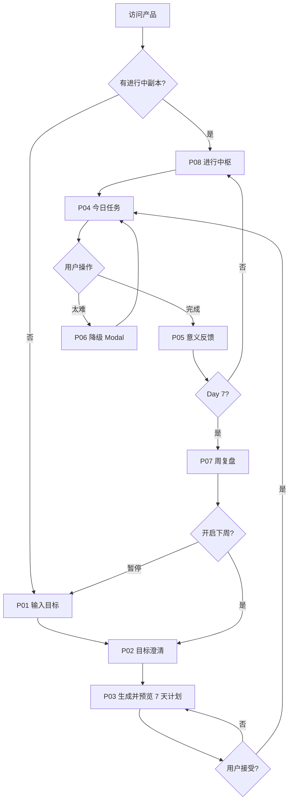
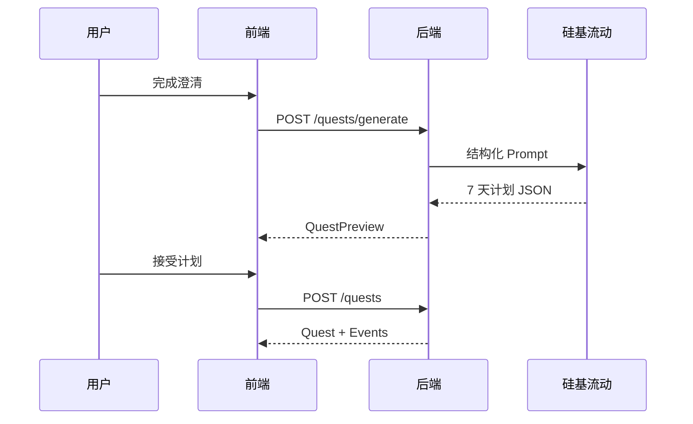

# GoalSlice 就这 — 产品需求文档（PRD 定稿）

> 阶段：C（定稿）｜活动项目：`goalslice`｜最后更新：2026-06-24

---

## 1. 背景与调研结论

### 1.1 产品定位

GoalSlice 就这是一款 **AI 职业成长助手**，帮助用户把模糊的职业成长目标拆成 **一周内可完成的小事件**，并通过克制、轻量的游戏化反馈陪用户持续推进。

**MVP 聚焦**：职业成长与技能提升类目标（转行、面试、作品集、AI Coding、表达能力等）。

**MVP 不做**：多目标并行、社交广场、积分商城、全年 OKR、复杂知识库、习惯/情绪/健康等泛化方向、用户登录。

### 1.2 核心价值

1. 把模糊目标具体化
2. 把长期目标拆成今天的小事件
3. 让用户每天完成一个足够小的行动
4. 让用户知道今天的行动为什么有意义
5. 通过周复盘形成阶段性成果
6. 基于用户上下文持续调整下一周计划

### 1.3 竞品与视觉方向（阶段 R 确认：融合方案）

| 参考来源 | 借鉴点 |
|---------|--------|
| LeveliU Daily Quests | 每日单 Quest 卡片、5 分钟叙事、低压力 SaaS 气质 |
| PokeBot | Guest 友好 onboarding、周任务拆解逻辑 |
| 重启人生 | Boss 战 / 周通关 / 成长资产叙事（视觉克制化） |

详细视觉证据见 `.sdd/tmp/visual-research.md`。

### 1.4 北极星指标

用户是否完成一个 **7 天职业成长小闭环**，并愿意开启下一周。

关键验证指标：一周计划接受率、Day 1 完成率、下一周开启率。

---

## 2. Mission、Persona

### Mission

让每一个有成长意愿的职场人，都能在今天找到一件值得做、做得完、做得有意义的小事件。

### Persona（MVP 主画像）

**成长停滞的主动型职场人**

- 有明确成长意愿，但目标虚、路径不清
- 常制定计划却难坚持，或不知道第一步做什么
- 每天可投入 5–30 分钟，希望低压力推进
- 典型诉求：转行到新行业、准备面试、提升复盘能力、提升文档写作能力、提升会议总结能力

---

## 3. 页面清单与跳转逻辑（A1）

### 3.1 页面清单

| 序号 | 页面名称 | 页面类型 | 可见角色 | 入口来源 | 跳转去向 |
|------|---------|---------|---------|---------|---------|
| P01 | 首页（目标输入） | 落地/表单页 | 所有访客 | 直接访问、Logo 点击 | P02；若有进行中副本 → P08 |
| P02 | 目标澄清 | 卡片问答流 | 所有访客 | P01 提交目标 | P03；可返回 P01 |
| P03 | 本周主线预览 | 预览/确认页 | 所有访客 | P02 完成澄清 | P04（接受计划）；可返回调整 P02 |
| P04 | 每日任务 | 任务执行页 | 所有访客 | P03、P08、P05 明日预告 | P05（完成）；P06（降级）；Day7 完成 → P07 |
| P05 | 完成反馈 | 结果/反馈页 | 所有访客 | P04 点击完成 | P08；Day6 完成 → 预告 P04 Day7 |
| P06 | 任务降级 | 弹层/子页 | 所有访客 | P04「太难了」 | 降级任务写回 P04 |
| P07 | 周复盘 | 复盘/总结页 | 所有访客 | P04 Day7 完成 | 开启下周 → P02/P03；暂停 → P01 |
| P08 | 进行中枢 | 进度仪表盘 | 所有访客 | 有活跃副本时默认落地 | P04（今日任务）；查看主线 → P03 只读 |

### 3.2 全局布局

- **无侧边栏**；顶部轻量导航：Logo + 本周进度（x/7）+ 主线标题摘要
- **单栏居中布局**，最大宽度约 640px，移动端 H5 友好，桌面 Web 同等体验
- **无登录态**：`session_id` 存 `localStorage`，副本数据存 `localStorage`（Demo）/ 后端 API（联调后）

### 3.3 页面跳转图

```text
                    ┌──────────────────────────────────────┐
                    │  有活跃副本？                          │
                    └─────────────┬────────────────────────┘
                          是 ↓         ↓ 否
                        P08 进行中枢    P01 首页
                              │              │
                              │         输入目标
                              │              ↓
                              │         P02 目标澄清（3-5 题）
                              │              ↓
                              │         P03 本周主线预览
                              │         [接受计划]
                              └──────→ P04 每日任务 ←──┐
                                         │   │         │
                            [太难了] → P06 降级 ─┘         │
                                         │ [已完成]       │
                                         ↓                │
                                    P05 完成反馈          │
                                         │                │
                              Day7 ──→ P07 周复盘         │
                                         │                │
                              [开启下周] → P02/P03 ───────┘
                              [暂停]   → P01
```

---

## 4. 主要功能定义与分析（A2）

### 页面：P01 首页（目标输入）

#### 功能清单

| 功能编号 | 功能名称 | 一句话描述 | 用户可感知的完成标准 |
|---------|---------|-----------|-------------------|
| F-01-01 | 目标自然语言输入 | 用户输入模糊职业成长目标 | 输入框可输入，占位文案清晰 |
| F-01-02 | 示例目标快捷填入 | 点击示例按钮填入输入框 | 至少 4 个示例可一键填入 |
| F-01-03 | 进行中副本检测 | 检测 localStorage 是否有活跃副本 | 有副本时展示「继续本周」入口跳转 P08 |
| F-01-04 | 开始澄清 | 提交目标进入澄清流程 | 点击开始后进入 P02 |

#### 功能边界

| 功能编号 | 包含 | 不包含 |
|---------|------|--------|
| F-01-01 | 单行/多行自然语言输入 | 语音输入、文件上传 |
| F-01-04 | 非空校验、基础长度限制 | 直接生成计划（必须先澄清） |

#### 与其他页面的关联

- F-01-04 → P02
- F-01-03 → P08

---

### 页面：P02 目标澄清

#### 功能清单

| 功能编号 | 功能名称 | 一句话描述 | 用户可感知的完成标准 |
|---------|---------|-----------|-------------------|
| F-02-01 | 逐题卡片问答 | 每次展示一题 + 卡片选项 | 3–5 题顺序推进，有进度指示 |
| F-02-02 | 跳过题目 | 允许跳过非必答题 | 每题有跳过按钮 |
| F-02-03 | 补充文字 | 可选补充说明 | 每题下有可选文本框 |
| F-02-04 | 上下文沉淀 | 答案写入用户上下文 | 完成后可进入 P03 |

#### 澄清题与选项：Demo / MVP vs 联调后（产品决策，2026-06-24）

| 阶段 | 题目文案 | 卡片选项 | 实现方式 |
|------|---------|---------|---------|
| **Demo / MVP** | 固定 5 题（见下「澄清题库（默认）」） | **固定选项列表**（与原型、`frontend/src/mocks/data.ts` 一致） | 前端 Mock + 后端可返回静态 `clarify_questions`；**不调用 LLM 生成题目或选项** |
| **Demo 之后（联调 / V1.2+）** | 仍可为固定 5 题骨架，或按目标微调题干 | **AI 针对性生成**：根据用户 `raw_goal` 为每题生成更贴合的选项（如「这个目标更接近哪一类？」下的选项应结合用户已输入目标语义） | `POST /api/v1/goals` 或独立澄清接口调用 LLM，返回 `clarify_questions[]`；需 Prompt + JSON 校验 + 降级回静态题库 |

**用户确认**：Demo 与 MVP 先验证固定卡片流与 7 天闭环；**不在 Demo/MVP 实现 AI 动态选项**。联调阶段再接入「针对性生成选项」能力。

**澄清题库（默认，Demo/MVP 静态）**：

1. 目标类型：转行/求职、技能提升、面试准备、作品集建设、个人品牌、职场晋升、其他
2. 一周期望变化：明确方向、完成产物、建立习惯、解决卡点、开始行动、求职准备
3. 每日可投入：5/15/30/60+ 分钟、不固定
4. 当前水平：完全小白 / 有一点了解 / 做过尝试 / 有基础缺成果 / 明确但缺节奏
5. 过去卡点：不知第一步 / 计划太复杂 / 太忙 / 学无产出 / 无反馈 / 容易忘 / 想太多不开始

#### 功能边界

| 功能编号 | 包含 | 不包含 |
|---------|------|--------|
| F-02-01 | 固定 5 题卡片流；Demo/MVP 固定选项 | 长问卷、多轮自由对话澄清；**Demo/MVP 不做 AI 生成选项** |
| F-02-04 | 结构化字段沉淀 | 复杂人格分析、长期知识库 |

**延后功能（Demo 之后，非 MVP）**：

| 功能编号 | 功能名称 | 说明 | 预计版本 |
|---------|---------|------|---------|
| F-02-05 | AI 针对性澄清选项 | 根据 `raw_goal` 为每题生成个性化卡片选项（题干可保持 5 题骨架） | V1.2（联调后迭代） |

#### 与其他页面的关联

- 完成 → P03；返回 → P01

---

### 页面：P03 本周主线预览

#### 功能清单

| 功能编号 | 功能名称 | 一句话描述 | 用户可感知的完成标准 |
|---------|---------|-----------|-------------------|
| F-03-01 | 生成本周主线 | AI 基于目标+上下文生成 7 天计划 | 展示主线标题、通关条件、7 日列表 |
| F-03-02 | 计划预览展示 | 展示每日标题、预计用时、简要说明 | 用户可浏览 Day1–Day7 |
| F-03-03 | 接受计划 | 用户确认后开始副本 | 点击后创建 quest，跳转 P04 Day1 |
| F-03-04 | 重新生成 | 不满意时重新生成计划 | 有「调整/重新生成」按钮 |
| F-03-05 | 非职业目标提示 | 识别 MVP 范围外目标 | 友好提示并建议收窄 |

#### 功能边界

| 功能编号 | 包含 | 不包含 |
|---------|------|--------|
| F-03-01 | 单次生成 7 天 | 全年计划、多目标并行 |
| F-03-03 | 须用户主动接受 | 自动生成后直接开始 |

#### 与其他页面的关联

- F-03-03 → P04；F-03-04 停留 P03

---

### 页面：P04 每日任务

#### 功能清单

| 功能编号 | 功能名称 | 一句话描述 | 用户可感知的完成标准 |
|---------|---------|-----------|-------------------|
| F-04-01 | 今日任务展示 | 展示当天唯一小事件 | 显示 Day 编号、标题、说明、用时、意义 |
| F-04-02 | 任务操作区 | 根据任务类型提供输入/勾选 | 支持文本输入、勾选完成 |

**任务操作区引导话术（产品决策，2026-06-24）**：

| 阶段 | 输入框 placeholder / 引导 | 任务具体说明放哪 |
|------|---------------------------|------------------|
| **Demo / MVP（当前）** | **普适默认文案**（如「写下或贴上你今天完成的内容…」），所有 `output_type=text` 任务共用 | 任务差异写在 `event_title` + `event_description`（卡片正文） |
| **联调后（T-007+）** | LLM 生成每日任务时附带 **`output_hint`**，按当天任务个性化引导 | 仍保留 `event_description` 作主说明；`output_hint` 专管输入框占位引导 |

**原则**：不在 Demo 阶段为某一天写死「四格填空」类占位符（仅适用于会议总结 Day3）；要么普适，要么 AI 针对性生成。原型 `index.html` 中 Day3 演示占位符仅作设计参考，实现以本表为准。

| F-04-03 | 标记完成 | 用户确认完成今日任务 | 点击后进入 P05 |
| F-04-04 | 请求降级 | 触发任务降级流程 | 点击后打开 P06 |
| F-04-05 | AI 辅助输入 | 如粘贴 JD 由 AI 辅助拆解 | 有输入框 + AI 响应展示区 |
| F-04-06 | 进度上下文 | 展示本周进度与主线摘要 | 顶部或侧边展示 x/7 |

#### 功能边界

| 功能编号 | 包含 | 不包含 |
|---------|------|--------|
| F-04-01 | 每天只展示 1 个主任务 | 任务列表、多天并列 |
| F-04-02 | 文本、勾选 | 文件上传、录音（V2） |

#### 与其他页面的关联

- F-04-03 → P05；F-04-04 → P06；Day7 完成 → P07

---

### 页面：P05 完成反馈

#### 功能清单

| 功能编号 | 功能名称 | 一句话描述 | 用户可感知的完成标准 |
|---------|---------|-----------|-------------------|
| F-05-01 | 完成确认 | 明确今日已完成 | 有完成态视觉反馈 |
| F-05-02 | 意义解释 | AI 解释今日动作与长期目标关系 | 展示 2–4 句具体意义文案 |
| F-05-03 | 成长资产发放 | 发放克制型成长证据 | 展示资产名称（如「能力地图碎片 x1」） |
| F-05-04 | 进度更新 | 更新本周进度 | 进度条显示 x/7 |
| F-05-05 | 明日预告 | 展示下一天任务标题 | Day7 前展示明日解锁内容 |

#### 功能边界

| 功能编号 | 包含 | 不包含 |
|---------|------|--------|
| F-05-03 | 文本型成长资产标签 | 金币商城、抽奖、宠物 |

#### 与其他页面的关联

- 完成 → P08 或返回 P04（次日）

---

### 页面：P06 任务降级

#### 功能清单

| 功能编号 | 功能名称 | 一句话描述 | 用户可感知的完成标准 |
|---------|---------|-----------|-------------------|
| F-06-01 | 降级方案生成 | AI 生成更小版本任务 | 展示 1–3 个降级选项 |
| F-06-02 | 采用降级 | 用户选择并替换今日任务 | 确认后 P04 显示新任务 |
| F-06-03 | 降级完成认定 | 降级完成仍计为有效推进 | 完成后正常进入 P05 |

#### 功能边界

| 功能编号 | 包含 | 不包含 |
|---------|------|--------|
| F-06-01 | 5 分钟版 / 只做第一步 / 明天继续 等 | 自动跳过当天 |

#### 与其他页面的关联

- F-06-02 → 回 P04；完成后 → P05

---

### 页面：P07 周复盘

#### 功能清单

| 功能编号 | 功能名称 | 一句话描述 | 用户可感知的完成标准 |
|---------|---------|-----------|-------------------|
| F-07-01 | 本周完成汇总 | 展示 7 天完成情况 | 列表或卡片展示完成/未完成 |
| F-07-02 | 产出物总结 | 归纳本周实际产出 | 有条目列出用户完成的内容 |
| F-07-03 | 执行观察 | AI 观察卡点与偏好 | 展示 1–2 条观察 |
| F-07-04 | 下周副本推荐 | 推荐下一周主线方向 | 展示下周目标与 Boss 条件 |
| F-07-05 | 开启下周 | 用户确认开启新副本 | 点击后进入 P02 或简化澄清 → P03 |
| F-07-06 | 暂停/结束 | 暂停当前目标线 | 回到 P01，副本标记暂停 |

#### 功能边界

| 功能编号 | 包含 | 不包含 |
|---------|------|--------|
| F-07-05 | 须用户主动开启 | 自动开启下周 |
| F-07-01 | Boss 战 = 阶段成果沉淀 | 高难度挑战任务 |

#### 与其他页面的关联

- F-07-05 → P02/P03；F-07-06 → P01

---

### 页面：P08 进行中枢

#### 功能清单

| 功能编号 | 功能名称 | 一句话描述 | 用户可感知的完成标准 |
|---------|---------|-----------|-------------------|
| F-08-01 | 副本状态概览 | 展示当前主线、通关条件、进度 | 进入即可看到本周状态 |
| F-08-02 | 进入今日任务 | 一键进入 P04 | 主 CTA 按钮 |
| F-08-03 | 成长资产列表 | 展示已积累资产 | 卡片或标签列表 |
| F-08-04 | 查看主线详情 | 只读查看 7 日计划 | 跳转 P03 只读模式 |

#### 功能边界

| 功能编号 | 包含 | 不包含 |
|---------|------|--------|
| F-08-01 | 单目标单副本 | 多目标切换 |

#### 与其他页面的关联

- F-08-02 → P04；F-08-04 → P03

---

## 5. 版本规划（A3）

### 5.1 V1 / MVP

| 页面 | 包含功能 | 排除功能 | 理由 |
|------|---------|---------|------|
| P01 | F-01-01~04 | — | 闭环入口 |
| P02 | F-02-01~04 | AI 动态追问题、**AI 针对性生成澄清选项（F-02-05）** | 固定卡片流先验证闭环 |
| P03 | F-03-01~05 | — | 计划生成与接受 |
| P04 | F-04-01~06 | 文件上传、录音 | Demo 以文本/勾选为主 |
| P05 | F-05-01~05 | — | 核心差异化反馈 |
| P06 | F-06-01~03 | — | 降低放弃率 |
| P07 | F-07-01~06 | — | 周闭环与续关 |
| P08 | F-08-01~04 | — | 回访落地 |

**MVP 技术范围**：

- 前端：React + TypeScript + Vite + Ant Design
- 后端：Python 3.11+ / FastAPI / PyCore
- 存储：Demo 阶段 `localStorage` + 后端 API 持久化（`session_id`）
- AI：硅基流动 API + 千问三系列
- 无用户登录、无 RAG、无支付

### 5.2 V2+

| 功能 | 预计版本 | 延后理由 |
|------|---------|---------|
| 用户登录与跨设备同步 | V1.1 | MVP 先验证 7 天闭环 |
| 多目标并行 | V1.2 | 分散注意力，复杂度高 |
| 文件/录音产出 | V1.2 | 需对象存储与审核 |
| AI 针对性生成澄清选项（F-02-05） | V1.2 | Demo/MVP 用静态选项；联调后按 `raw_goal` 生成更贴合的卡片选项 |
| AI 动态澄清对话 | V1.2 | 固定卡片流先验证 |
| 长期成长地图 | V2 | 需多周数据积累 |
| 职业技能模板库 | V2 | 提升计划质量 |
| 习惯/创作/健康方向 | V3+ | 扩大边界需单独验证 |

---

## 6. 复杂功能业务链路与关键实现思路（A4）

### 6.1 链路：目标澄清 → 一周计划生成

- **触发场景**：P02 完成 → 进入 P03
- **Demo / MVP（当前）**：
  1. `POST /api/v1/goals` 返回**静态** `clarify_questions`（5 题 + 固定 `options`，与原型一致）
  2. 用户逐题选择 → `PATCH /api/v1/goals/{id}/clarify` 沉淀 `UserContext`
  3. **不**在创建目标或澄清阶段调用 LLM 生成题目/选项
- **Demo 之后（F-02-05，V1.2+）**：
  1. `POST /api/v1/goals` 携带 `raw_goal` → 后端 LLM 生成 `clarify_questions[]`（每题 `question` + 针对性 `options`）
  2. 生成失败或超时 → **降级**为静态默认题库（与 Demo 相同）
  3. 其余流程不变
- **计划生成（MVP 起即做）**：
  1. 前端汇总 `raw_goal` + 澄清答案 → `POST /api/v1/quests/generate`
  2. 后端组装 Prompt（含目标类型、时间、水平、卡点）→ 调用硅基流动 LLM
  3. LLM 返回结构化 JSON：`quest_title`、`success_condition`、`days[7]`
  4. 前端渲染预览；用户接受后 `POST /api/v1/quests` 创建副本
- **关键技术选型**：硅基流动 OpenAI 兼容 API；`response_format` JSON 模式或 Prompt 约束 + 解析校验
- **须用户确认**：接受计划（F-03-03）

### 6.2 链路：每日任务完成 → 意义反馈

- **触发场景**：P04 点击完成 → P05
- **实现思路**：
  1. `POST /api/v1/events/{id}/complete` 携带用户产出（可选）
  2. 后端基于任务上下文 + 用户目标调用 LLM 生成意义解释 + 成长资产名
  3. 更新事件状态、进度、资产列表
- **须用户确认**：无（完成后自动反馈）

### 6.3 链路：任务降级

- **触发场景**：P04 点击「太难了」→ P06
- **实现思路**：
  1. `POST /api/v1/events/{id}/downgrade` 携带原任务 + 用户上下文
  2. LLM 生成 1–3 个降级方案（保留核心价值、降低时长/认知负担）
  3. 用户选择后 `PATCH` 替换当日任务，`status=downgraded`
- **须用户确认**：采用降级方案（F-06-02）

### 6.4 链路：周复盘 → 下周推荐

- **触发场景**：Day7 完成 → P07
- **实现思路**：
  1. 汇总本周 events 完成率、产出、降级次数、用户输入
  2. LLM 生成复盘文案 + 下周 `quest_title` 建议
  3. 用户「开启下周」→ 携带复盘上下文进入简化澄清或直达生成
- **须用户确认**：开启下周（F-07-05）

### 6.5 链路：会话级身份（无登录）

- **实现思路**：
  1. 首次访问生成 `session_id`（UUID）存 `localStorage`
  2. 所有 API 请求头携带 `X-Session-Id`
  3. 后端以 `session_id` 关联 goal、context、quest、events、assets
- **Demo 降级**：后端不可用时，前端 Mock LLM 响应 + 纯 localStorage

### 6.6 AI Agent 角色与行为原则

**角色**：懂职业成长路径、擅长把目标拆成小事件的 AI 成长设计师。

**行为原则**：

1. 不直接给宏大计划；先澄清再生成
2. 每次只推进一个小事件
3. 任务必须小到用户愿意开始
4. 每个任务都要有意义解释
5. 用户困难时不批评，而是降级
6. 反馈具体，不空泛夸奖
7. 记住用户偏好用于后续调整

---

## 7. AI 功能章节

### 7.1 AI 参与功能一览

| 功能 | AI 职责 | 输入 | 输出 | 自动执行边界 |
|------|---------|------|------|-------------|
| 目标类型识别 | 分类 | raw_goal | goal_type 枚举 | 自动 |
| 一周计划生成 | 拆解 7 天 | goal + context | 结构化 quest | 须用户接受 |
| 任务降级 | 缩小任务 | 原任务 + context | 降级方案列表 | 须用户选择 |
| 完成反馈 | 意义解释 | 任务 + 产出 | 文案 + 资产名 | 自动 |
| 周复盘 | 总结 + 推荐 | 周数据 | 复盘 + 下周建议 | 须用户开启下周 |
| 日内辅助 | 如拆 JD | 用户粘贴文本 | 分析结果 | 辅助展示，不自动写入 |

### 7.2 模型 / API 配置（用户已确认）

| 配置项 | 值 | 状态 |
|--------|-----|------|
| 供应商 | 硅基流动（SiliconFlow） | 已确认 |
| API Key 来源 | 用户提供 | 已确认 |
| base_url | `https://api.siliconflow.cn/v1`（待联调验证） | 待联调 |
| model | `Qwen/Qwen3.5-27B`（硅基流动） | **已确认**（用户 2026-06-24） |
| Embedding / Rerank | 无（MVP 不做 RAG） | 不适用 |

### 7.3 默认意图分类

`career_switch`（转行求职）、`skill_up`（技能提升）、`interview_prep`（面试准备）、`portfolio`（作品集）、`expression`（表达提升）、`promotion`（职场晋升）、`personal_brand`（个人品牌）、`other`

### 7.4 默认提示词方向

- 系统角色：AI 成长设计师，低压力、小步、有意义解释
- 计划生成：只输出 7 天、每天 1 事件、有递进、Day7 为 Boss 成果、匹配用户时长
- 降级：保留核心价值，降低时长与认知负担
- 反馈：说明完成了什么、对应什么能力、如何连接长期目标

### 7.5 智能边界

| 类型 | 场景 |
|------|------|
| 可自动执行 | 目标分类、澄清引导、完成反馈文案；**V1.2+** 澄清卡片选项针对性生成（F-02-05） |
| 必须用户确认 | 接受计划、采用降级、开启下周副本 |
| 必须追问 | 目标过泛且澄清不足时 |
| 必须拒绝/收窄 | 非职业成长类目标（习惯/健康/情绪等）提示 MVP 暂不覆盖 |

### 7.6 AI 材料状态

- 提示词/意图体系：**未提供**，PRD 写入默认配置，阶段 C 前可调整
- 示例输入输出：**未提供**，开发阶段补充 Few-shot

---

## 8. 数据契约确认清单（A5）

### 8.1 业务数据契约

#### 目标（Goal）

- [x] `goal_id`（uuid）
- [x] `session_id`（string，匿名会话）
- [x] `raw_goal`（string，用户原始输入）
- [x] `goal_type`（enum：见 7.3）
- [x] `refined_goal`（string，澄清后目标）
- [x] `weekly_outcome`（string，一周期望变化）
- [x] `status`（enum：`active` / `completed` / `paused`）
- [x] `created_at` / `updated_at`（datetime）

#### 用户上下文（UserContext）

- [x] `session_id`（string，主键）
- [x] `current_level`（enum：见 F-02 题库）
- [x] `available_time`（enum：`5m` / `15m` / `30m` / `60m+` / `flexible`）
- [x] `failure_reason`（enum：见 F-02 题库）
- [x] `preferred_intensity`（enum：`low` / `medium`，默认 `low`）
- [x] `notes`（string，可选补充）

#### 一周副本（Quest）

- [x] `quest_id`（uuid）
- [x] `goal_id`（uuid，外键）
- [x] `quest_title`（string，本周主线）
- [x] `success_condition`（string，通关条件）
- [x] `total_days`（int，默认 7）
- [x] `current_day`（int，1–7）
- [x] `status`（enum：`in_progress` / `completed` / `abandoned`）
- [x] `created_at` / `updated_at`（datetime）

#### 每日小事件（DailyEvent）

- [x] `event_id`（uuid）
- [x] `quest_id`（uuid，外键）
- [x] `day_index`（int，1–7）
- [x] `event_title`（string）
- [x] `event_description`（string）
- [x] `estimated_time`（string，如「15 分钟」）
- [x] `meaning`（string，任务意义）
- [x] `output_type`（enum：`text` / `checkbox`）
- [x] `user_output`（string，可选，用户产出）
- [x] `status`（enum：`pending` / `in_progress` / `completed` / `downgraded`）
- [x] `original_event_id`（uuid，可选，降级时指向原任务）
- [x] `completed_at`（datetime，可选）

#### 成长资产（GrowthAsset）

- [x] `asset_id`（uuid）
- [x] `session_id`（string）
- [x] `quest_id`（uuid）
- [x] `event_id`（uuid，可选）
- [x] `asset_type`（enum：`ability_fragment` / `work_draft` / `interview_story` / `case_note` / `other`）
- [x] `asset_name`（string，如「能力地图碎片」）
- [x] `asset_content`（string，可选）
- [x] `created_at`（datetime）

#### 业务规则

- [x] MVP 同时仅允许 **1 个 active goal / 1 个 in_progress quest**
- [x] 每日仅展示 `current_day` 对应事件
- [x] 降级后 `status=downgraded` 的新事件替代当日任务，完成仍推进 `current_day`
- [x] Day7 完成触发周复盘，quest `status=completed`
- [x] 非 MVP 目标类型：返回提示，不生成计划

### 8.2 接口响应格式契约

#### 统一响应格式

- [x] 成功：`{"code": 200, "message": "success", "data": { ... }}`
- [x] 错误：`{"code": <错误码>, "message": "<错误描述>", "data": null}`
- [x] 分页（V2）：`{"code": 200, "message": "success", "data": {"items": [...], "total": 100, "page": 1, "page_size": 20}}`

#### HTTP 状态码约定

- [x] 200：成功
- [x] 400：参数错误
- [x] 401：未认证（V2 登录后使用）
- [x] 403：无权限
- [x] 404：资源不存在
- [x] 422：业务校验失败（如非 MVP 目标）
- [x] 500：服务器内部错误
- [x] 503：LLM 服务不可用

#### 核心 API 端点（初稿）

| 方法 | 路径 | 说明 |
|------|------|------|
| POST | `/api/v1/goals` | 创建目标 |
| PATCH | `/api/v1/goals/{id}/clarify` | 提交澄清答案 |
| POST | `/api/v1/quests/generate` | 生成一周计划（预览） |
| POST | `/api/v1/quests` | 接受并创建副本 |
| GET | `/api/v1/quests/active` | 获取当前活跃副本 |
| GET | `/api/v1/events/today` | 获取今日任务 |
| POST | `/api/v1/events/{id}/complete` | 完成任务 |
| POST | `/api/v1/events/{id}/downgrade` | 请求降级方案 |
| PATCH | `/api/v1/events/{id}/apply-downgrade` | 采用降级方案 |
| POST | `/api/v1/quests/{id}/review` | 生成周复盘 |
| POST | `/api/v1/quests/{id}/next-week` | 开启下周 |
| GET | `/api/v1/assets` | 获取成长资产列表 |

---

## 9. 外部依赖与配置草稿（A5-3）

| 依赖 | 用途 | 关键配置字段 | Key/账号来源 | 存放位置 | 缺失时策略 | 状态 |
|------|------|-------------|-------------|----------|-----------|------|
| LLM（硅基流动 / 千问三系列） | 计划生成、降级、反馈、复盘、日内辅助 | `LLM_API_KEY` `LLM_BASE_URL` `LLM_MODEL` | 用户提供 | `backend/.env` | Mock 固定 JSON + 占位文案 | **已确认来源，型号待联调** |
| Embedding | 无 | — | — | — | — | 无 |
| Rerank | 无 | — | — | — | — | 无 |
| 第三方 API / 数据源 | 无 | — | — | — | — | 无 |
| 支付 / 结算 | 无 | — | — | — | — | 无 |
| 短信 / 邮件 / 推送 | 无 | — | — | — | — | 无 |
| 对象存储 | 无（MVP 文本产出） | — | — | — | 纯文本存 DB/localStorage | 无 |
| 第三方登录 / OAuth | 无（MVP 无登录） | — | — | — | session_id | 无 |
| 地图 / 定位 / 实名 / 风控 | 无 | — | — | — | — | 无 |

**用户确认记录（2026-06-24）**：

- LLM：硅基流动 API Key 由用户提供，模型倾向千问三系列
- MVP 无登录，使用 `session_id` + localStorage
- 无其他外部依赖

---

## 10. 附录：页面文案参考

| 页面 | 关键文案 |
|------|---------|
| P01 | 主文案：「把长期目标，变成这一周能完成的小事件。」占位：「你最近最想推进的一件职业成长目标是什么？」 |
| P01 示例 | 转行到新行业、准备面试、提升复盘能力、提升文档写作能力、提升会议总结能力 |
| P04 | 按钮：「我已经完成」「今天太难了，帮我降级」 |
| P07 | 按钮：「开启下一周副本」「暂停，下次再说」 |

---

## 11. 路线图（版本规划终版）

| 版本 | 范围 | 交付标准 |
|------|------|---------|
| **V1 / MVP** | P01–P08 全闭环、硅基流动 LLM、匿名 session、SQLite 持久化 | 用户可完成 7 天副本并开启下周 |
| V1.1 | 用户登录、跨设备同步 | 账号体系 + 数据迁移 |
| V1.2 | 文件/录音产出、对象存储 | 作品集类目标支持上传 |
| V2 | 职业技能模板库、长期成长地图 | 计划质量提升 |
| V3+ | 习惯/创作等泛化方向 | 单独验证后扩展 |

MVP 明确不做：多目标并行、社交、积分商城、RAG 知识库、用户登录。

---

## 12. 技术架构蓝图

### 12.1 技术选型

| 层级 | 选型 | 说明 |
|------|------|------|
| 前端框架 | React 18 + TypeScript | 业务 SPA |
| 构建 | Vite | 开发代理、生产构建 |
| 路由 | react-router v6 | 8 页路由 + 活跃副本守卫 |
| 状态 | Zustand | session、quest、UI 状态 |
| 请求 | Axios | 统一拦截器、`X-Session-Id` |
| UI | Ant Design 5 | 桌面 Web 优先，640px 居中适配 H5 |
| 后端 | Python 3.11+ / FastAPI | PyCore 脚手架 |
| ORM | SQLAlchemy 2 + async | SQLite（MVP） |
| LLM | 硅基流动 OpenAI 兼容 API | 千问三系列 |
| 部署 | 前端静态 + 后端单容器 | MVP 单机部署 |

### 12.2 分层架构

```text
frontend/          # React SPA，页面 + 组件 + services
backend/
  app/
    api/routes/    # FastAPI 路由
    services/      # 业务逻辑（goal、quest、event、llm）
    models/        # SQLAlchemy 模型
    schemas/       # Pydantic DTO
  pycore/          # 配置、日志、LLM 集成（复用项目 pycore）
```

### 12.3 部署方案（MVP）

- 前端：`npm run build` → Nginx 静态托管或 Vite preview
- 后端：uvicorn 单进程，SQLite 文件卷持久化
- 环境变量：`backend/.env`（LLM Key 不入库）

### 12.4 会话模型

- 无登录：首次访问前端生成 `session_id`（UUID）→ `localStorage`
- 所有 API 携带 `X-Session-Id` 头
- 后端按 session 隔离 goal / quest / event / asset

---

## 13. 原型说明

### 13.1 原型文件

| 文件 | 用途 |
|------|------|
| `docs/prototypes/index.html` | 可点击流程演示（主入口） |
| `docs/prototypes/overview.html` | 8 页平铺预览 |
| `docs/prototypes/assets/styles.css` | R1 珊瑚红色板与组件样式 |
| `docs/prototypes/README.md` | 原型交接说明 |

### 13.2 页面与原型映射

| PRD 页面 | 原型 screen / 区域 | 路由（生产） |
|---------|-------------------|-------------|
| P01 首页 | `#screen-home` | `/` |
| P02 澄清 | `#screen-clarify` | `/clarify` |
| P03 主线预览 | `#screen-preview` | `/quest/preview` |
| P04 每日任务 | `#screen-daily` | `/quest/today` |
| P05 完成反馈 | `#screen-feedback` | `/quest/feedback` |
| P06 降级 | `#modal-downgrade` | Modal on P04 |
| P07 周复盘 | `#screen-review` | `/quest/review` |
| P08 中枢 | `#screen-hub` | `/hub` |

### 13.3 视觉定稿（方案 R1）

- Primary `#E8463A`、Background `#F5F5F7`、完成反馈黑勾 + 珊瑚红环
- 演示主线：提升会议总结能力（首页示例覆盖多元职业成长场景）
- 设计证据：`.sdd/tmp/visual-research.md`

---

## 14. 核心流程图

### 14.1 主流程



### 14.2 计划生成时序



### 14.3 异常分支

- LLM 不可用 → 503 + 前端 Mock 降级文案
- 非 MVP 目标类型 → 422 + 友好收窄提示
- 无活跃副本访问今日任务 → 404 + 引导回首页

---

## 15. 组件交互说明

### 15.1 前端模块

| 模块 | 职责 | 依赖 |
|------|------|------|
| `pages/Home` | P01 目标输入 | goalService |
| `pages/Clarify` | P02 卡片流 | goalService |
| `pages/QuestPreview` | P03 计划预览 | questService |
| `pages/DailyTask` | P04 + P06 Modal | eventService |
| `pages/Feedback` | P05 | eventService |
| `pages/Hub` | P08 | questService, assetService |
| `pages/Review` | P07 | questService |
| `components/AppHeader` | 顶栏进度 | questStore |
| `components/QuestCard` | 今日任务卡 | — |
| `components/MeaningBlock` | 意义说明块 | — |
| `services/api` | Axios 实例 | — |
| `stores/session` | session_id | localStorage |

### 15.2 后端模块

| 模块 | 职责 |
|------|------|
| `GoalService` | 目标创建、澄清、类型识别 |
| `QuestService` | 计划生成、接受、活跃副本、复盘 |
| `EventService` | 今日任务、完成、降级 |
| `AssetService` | 成长资产发放与列表 |
| `LLMService` | 硅基流动调用、JSON 解析与校验 |

---

## 16. 技术选型与风险

| 风险 | 影响 | 缓解 |
|------|------|------|
| LLM 输出不稳定 | 计划质量波动 | JSON Schema 校验 + 重试 1 次 + 默认模板兜底 |
| 目标过泛 | 计划不贴合 | 澄清 5 题 + MVP 范围拒绝 |
| 无登录丢数据 | 换设备丢失 | MVP 接受；V1.1 登录同步 |
| 硅基流动型号变更 | 联调失败 | env 配置化 `LLM_MODEL` |
| 完成率低 | 北极星不达标 | 降级机制 + 小任务设计 |

---

## 17. 阶段 C 定稿确认

- [x] 与已确认原型一致（R1 色板、8 页、会议总结演示主线）
- [x] 技术选型已确定
- [x] 接口契约见 `docs/api-contracts.md`
- [x] 开发计划见 `docs/Plan.md`
- [x] 外部依赖：硅基流动 LLM 已确认，无其他 Key 依赖
